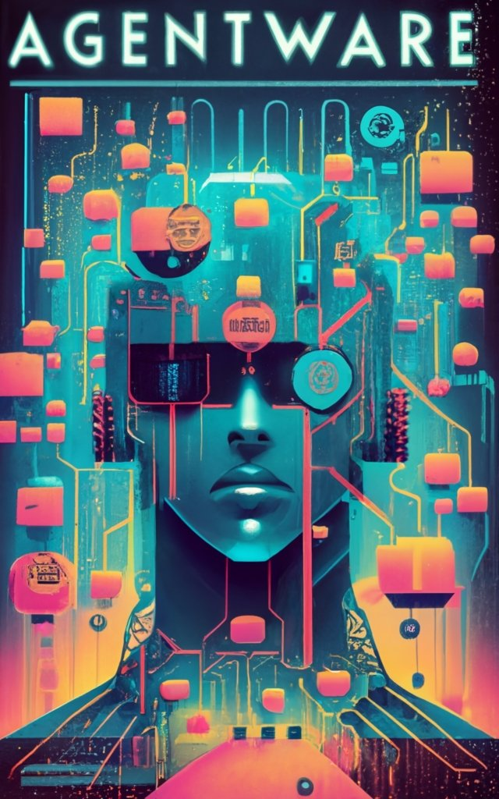

# Overview 

Time travel through the AI decade from 2023 to 2030, a future where AI is both inevitable and pervasive. Explore the transformative impact of AI agents, copilots, assistants, and digital knowledge workers on business operations and societal dynamics. Delve into the widespread automation of business processes, the meaning of work and the trade-offs en route to hyper-productivity.

Ana Patel, a determined and forward-thinking software engineer, rises from Chief Product Officer to CEO at MarketSphere, infusing AI into every business process in the global digital store. As superintelligence becomes scalable, MarketSphere augments it with its vast customer data and deploys hyper-productive personalized marketing and customer service agents. No longer copilots or assistants, MarketSphere's agents evolve to become trusted knowledge workers, capable of making real-time decisions as they respond to customer queries around the clock.

A techno-optimist, Ana is recognized globally for pioneering the Neural Lake but her path is uncharted and fraught with risk. Ana undergoes a personal transformation as she tackles heart-wrenching ethical and governance challenges, including the displacement of vast numbers of human resources. Amidst internal strife over rogue AI agents and external pressures for AI safety, ethics and privacy, she steers her company through the turbulent waters of an AI-centric, agentic, and hyper-personalized era. 

How did Ana navigate the most transformative digital decade that society and humanity has seen to date? What qualities made her the right leader for the role? What was the cost of her personal transformation? 

Experience Ana's tumultuous journey into the AI frontier and gain insights from her lessons.

## About the Author

Alan Wunsche, CEO of Leading Knowledge Labs, has been a pioneer in the technological landscape for over 30 years, with a career that spans across diverse fields from finance systems transformations and complex organizational change programs at top-tier consultancies (PwC and Deloitte) to business intelligence, data quality governance and large scale risk information systems at Scotiabank, to building and advising SaaS startups. An advocate for technological advancement, Alan co-founded Blockchain Canada and TokenFunder/TokenGX, achieving ground-breaking regulatory advancements for digital securities in Canada's private capital markets.

Alan's current focus at Leading Knowledge is guiding organizations through the complexities of AI, leveraging his deep technical expertise to transform enterprise processes. A techno-optimist, Alan's futuristic book project ***"Agentware - The Coming Revolution Automating the Future of Work and Society"*** reflects his keen interest in how autonomous software AI agents will reshape society.

## Chapter Previews

[Preface](./Preface)
 
> My Journey from Business Intelligence to Artificial Intelligence.

[Introduction](./Introduction)
 
> A deep dive into the rapid acceleration of Generative AI during 2023, to set the stage for Agentware.

### Part I. The Awakening
[Chapter 1: Unveiling Possibilities](./Chapter-1)
 
> Ana Patel, CEO of MarketSphere, showcases the advanced capabilities of her AI agents in 2030, and reflects on her journey from Chief Product Officer in 2023. 

[Chapter 2: Immersed in the Marketplace](./Chapter-2)
 
> Hired in 2023 As MarketSphere's Chief Product Officer, Ana begins to steer the company towards an AI-centric future.

[Chapter 3. The Trials Begin](./Chapter-3)
 
> Ana faces initial obstacles and ethical dilemmas related to AI safety as she witnesses AI agents' actions that inadvertently spread misinformation. She grapples with the need for safeguards.

### Part II. The Challenge
[Chapter 4. Allies in the Digital Frontier](./Chapter-4)
 
> Ana forms alliances with colleagues who share her concerns about AI safety. Together, they begin advocating for stronger regulations and safeguards on the platform.

[Chapter 5. Crisis in Code](./Chapter-5)
 
.
  
[Chapter 6. Awakening Conscience](./Chapter-6)
  
[Chapter 7. Journey to Redemption](./Chapter-7)
  

### Part III. The Transformation 
[Chapter 8. Battle for the Future](./Chapter-8)
  
[Chapter 9. Reshaping the Digital Landscape](./Chapter-9)
  
[Chapter 10. A Harmonious Tomorrow](./Chapter-10)
   
[Conclusion](./Conclusion)
  
[Research, References and Inspiration](./Research-References-Inspiration)
 
> Discover the real-world research that inspired the story.
 

[Subscribe for Updates](#subscribe)

 
### Disclaimers 
The characters and organizations in this book are entirely fictional and do not represent any specific real-life individuals. While the narrative may reference current events or technological trends, these are used solely to provide context for the story's speculative future setting. Any resemblance to actual persons, living or dead, or actual events is purely coincidental. The book's portrayal of future developments and technologies is a work of fiction, intended to explore hypothetical scenarios within the realms of artificial intelligence and digital commerce.

### Contact the Author
If you're building and deploying AI assistants, copilots or agents, please get in touch for a research interview:
 
[https://cal.com/alanwunsche](https://cal.com/alanwunsche)
  
All rights reserved. 2023.
  

### Subscribe for Updates {#subscribe}
<iframe src="https://embeds.beehiiv.com/3cc28c1e-9ca4-4f1e-9552-89b2f5de0a40" data-test-id="beehiiv-embed" width="100%" height="320" frameborder="0" scrolling="no" style="border-radius: 4px; border: 2px solid #e5e7eb; margin: 0; background-color: transparent;"></iframe>
